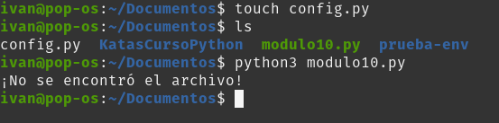
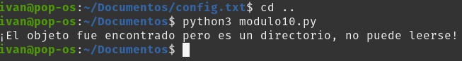

# Manejo de excepciones

Para esta Kata realizaré el ejercicio que viene en el MD del módulo 10.

Intentaremos abrir un archivo de configuración con una extensión diferente a la esperada para obtener un error al ejecutar el programa.

Primero que nada, crearemos nuestro programa en un archivo de python llamado modulo10.py:

```
#!/bin/python3
try:
   configuration = open('config.txt')
except FileNotFoundError:
   print("¡No se encontró el archivo!")
except IsADirectoryError:
   print("¡El objeto fue encontrado pero es un directorio, no puede leerse!")
except (BlockingIOError, TimeoutError):
   print("¡Archivo de sistema saturado, no pudo completarse la lectura del archivo!")
```

Como podemos observar, el programa espera un archivo de tipo .txt, intentaremos pasarle primero un archivo de extensión diferente y veamos qué ocurre:



Para este ejemplo creamos un archivo config.py, que difiere de config.txt, al ser de extensión diferente el script imprime el mensaje de la excepción que no encontró el archivo buscado.

Ahora intentemos crear un *directorio* con el nombre de config.txt y veremos qué ocurre:


* Primero creamos el directorio *config.txt*
* Después creamos un archivo vacío para llenar el directorio creado

  Posteriormente, nos dirigiremos nuevamente al directorio *Documentos* e intentemos correr el script nuevamente:

  

  Como se puede observar, el script detecta que existe un objeto de nombre *config.txt* pero lanza la excepción de tipo directorio.

## Resumen

Para ser un desarrollador eficaz, debes saber cómo funcionan las excepciones y cómo controlarlas. En este módulo, has descubierto cómo usar la salida de excepción para la depuración, cómo detectar y generar excepciones y, por último, cómo afecta a la lógica de un programa cuando se producen excepciones.

Con los conocimientos del uso y el control de excepciones, puedes evitar problemas comunes, como detectarlos todos para evitar tracebacks.

En este módulo, has obtenido información sobre estas aptitudes:

* Leer y usar la salida de error de las excepciones
* Controlar correctamente las excepciones
* Generar excepciones con mensajes de error útiles
* Usar excepciones para controlar el flujo de un programa


Curso Propedútico de Python para Launch X - Innovacción Virtual.

Material desarrollado con base en los contenidos de
MSLearn y la metáfora de LaunchX, traducción e implementación por:
Fernanda Ochoa - Learning Producer de LaunchX.

Redes:

* GitHub: [FernandaOchoa](https://github.com/FernandaOchoa)
* Twitter: [@imonsh](https://twitter.com/imonsh)
* Instagram: [fherz8a](https://www.instagram.com/fherz8a/)
